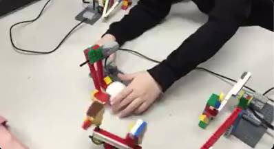

## Early stuff

I did programming for the first time with Lego WeDo and Scratch when I was a K student. Here are some of my very early apps and models!!! You can play a GIF animation by clicking each picture below. Its MP4 version is available too. 

- Scratch "games" I made when I was a K student: 

  
  

- Lego WeDo app I made when I was a 1st grader: 

  

