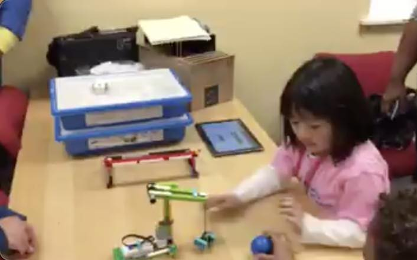
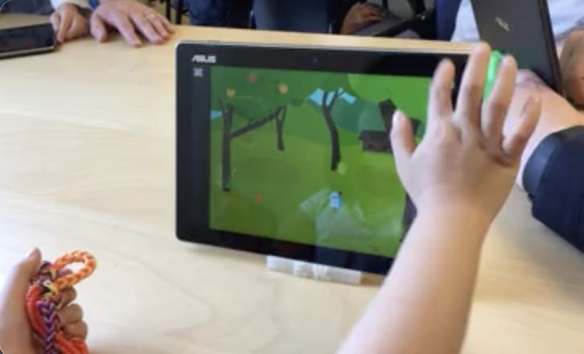
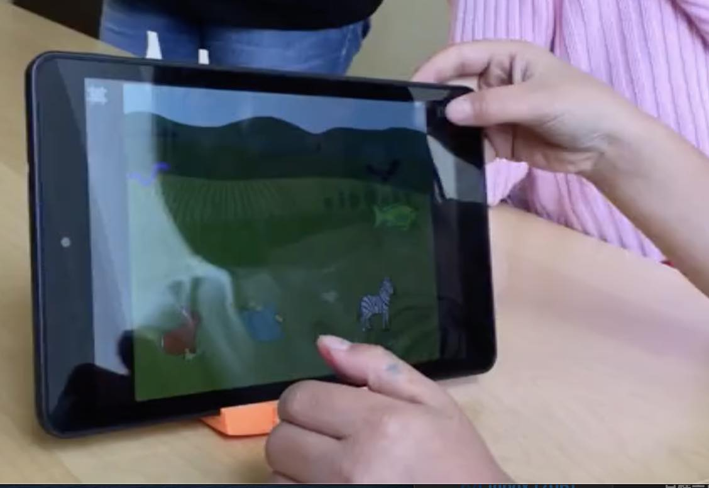
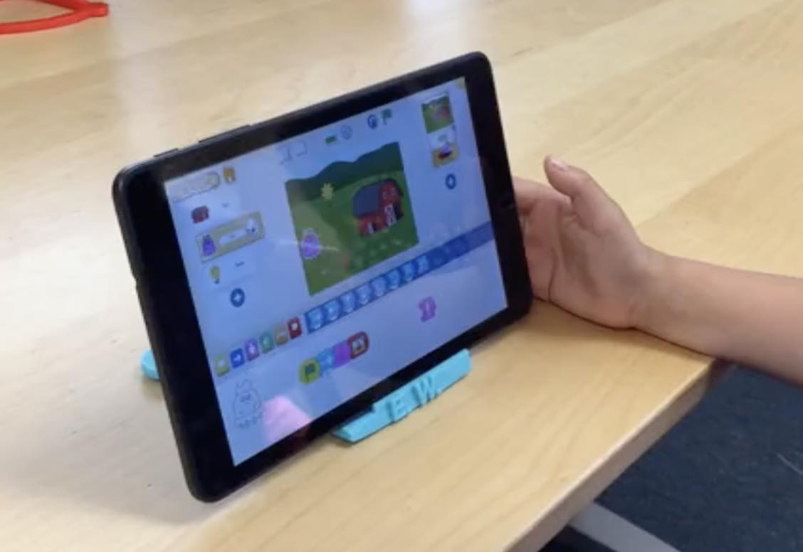
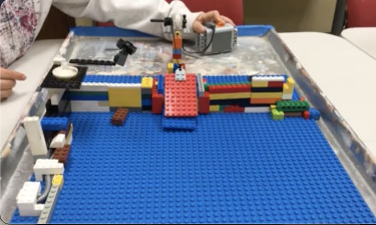
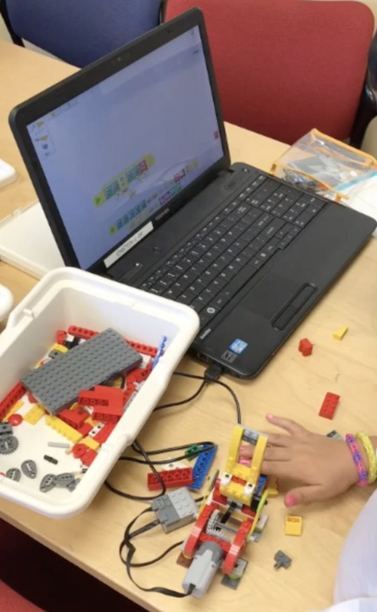

## Early stuff

I did programming for the first time with Lego WeDo and Scratch when I was a K student. Here are some of my very early apps and models!!! You can play a GIF animation by clicking each picture below. Its MP4 version is available [here](images/). 

- Lego WeDo models and apps

 

 

- Scratch "games" 

 

- Some more Lego WeDo models and apps

 

